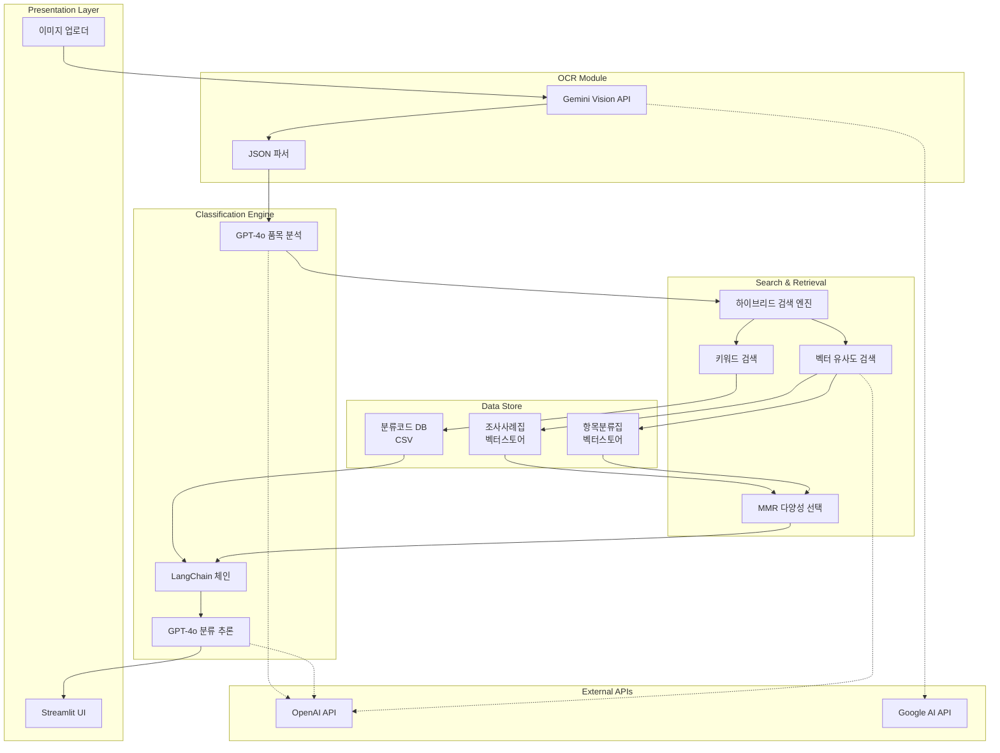
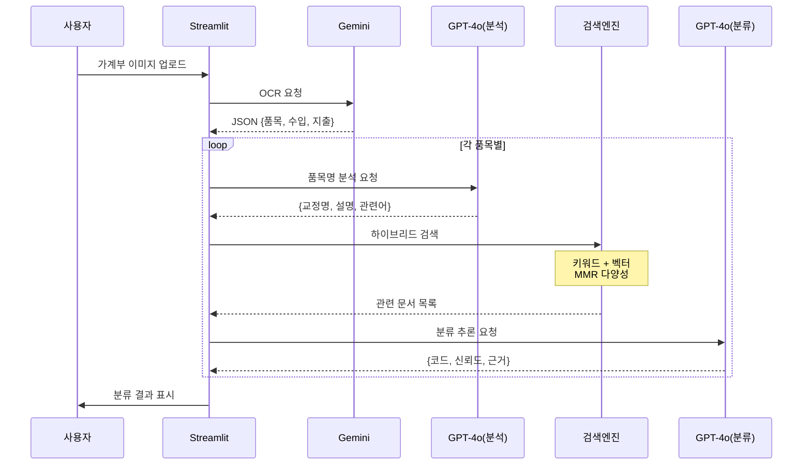

# 🏗 CateGOMe 시스템 아키텍처

## 📋 목차
1. [시스템 개요](#시스템-개요)
2. [아키텍처 다이어그램](#아키텍처-다이어그램)
3. [핵심 컴포넌트](#핵심-컴포넌트)
4. [데이터 플로우](#데이터-플로우)
5. [기술 상세](#기술-상세)
6. [확장성 및 성능 고려사항](#확장성-및-성능-고려사항)

## 시스템 개요

CateGOMe는 RAG(Retrieval-Augmented Generation) 기반의 멀티모달 AI 시스템으로, 다음과 같은 3층 아키텍처로 구성됩니다:

- **Presentation Layer**: Streamlit 웹 인터페이스
- **Business Logic Layer**: LangChain 기반 AI 파이프라인
- **Data Layer**: FAISS 벡터스토어 + CSV 데이터베이스

## 아키텍처 다이어그램



## 핵심 컴포넌트

### 1. 🖼 OCR 모듈
```python
# 주요 기능: 가계부 이미지 → 구조화된 데이터
gemini_model = genai.GenerativeModel("gemini-1.5-flash")

# 입력: 이미지 바이트
# 출력: {"items": [{"name": "품목명", "income": 0, "expense": 10000}]}
```

**특징:**
- JSON 스키마 강제로 안정적 파싱
- 쉼표, 공백 등 자동 정제
- 체크박스, 빈 줄 자동 필터링

### 2. 🔍 하이브리드 검색 엔진

#### 2.1 품목 분석 (LLM 전처리)
```python
def _get_term_info_via_llm(llm, user_query):
    # 입력: "파플리시티 구독료 10,000원"
    # 출력: {
    #   "term": "퍼플렉시티",  # 오타 교정
    #   "description": "AI 기반 검색 서비스 구독료",
    #   "related_terms": ["구독서비스", "플랫폼", "AI", "검색"]
    # }
```

#### 2.2 키워드 검색
```python
def _keyword_search(df, term):
    # CSV 데이터에서 부분 일치 검색
    # 검색 필드: 항목명, 항목분류내용, 포함항목, 제외항목
```

#### 2.3 벡터 유사도 검색
```python
def _similarity_topk_for_term(vs, embeddings, term, k=3):
    # MMR(Maximum Marginal Relevance) 적용
    # 유사도와 다양성의 균형 (lambda_mult=0.5)
```

### 3. 🤖 분류 추론 엔진

#### LangChain 프롬프트 체인
```python
prompt_template_single = PromptTemplate.from_template("""
    SYSTEM: 카테고미(CateGOMe) AI - 극도로 엄격한 규칙 준수
    
    ## 절대 규칙 ##
    1. 수입/지출 규칙: expense > 0 → code ≥ 1000
    2. 우선순위: 조사사례집 > 항목분류집
    
    ## 분류 타입 결정 ##
    - DEFINITE: 90% 이상 확신
    - AMBIGUOUS: 여러 후보 가능
    
    Question: {question}
    Context: {context}
""")
```

#### 추론 로직
1. **컨텍스트 우선순위 적용**
   - 조사사례집 매칭 → 즉시 적용
   - 항목분류집 → 보조 참조

2. **모호성 판단 기준**
   - 회사명만 있고 서비스 불명확 (네이버 → 쇼핑? 페이? 웹툰?)
   - 소득 주체 불명 (급여 → 가구주? 배우자?)
   - 품목 세부사항 부족 (고등어 → 간고등어? 통조림?)

### 4. 📊 데이터 스토어

#### 벡터스토어 구조
```
vectorstores/
├── cases/                 # 조사사례집 (우선순위 높음)
│   ├── index.faiss       # 3072차원 벡터 인덱스
│   └── index.pkl         # 메타데이터 + 원문
└── classification/        # 항목분류집
    ├── index.faiss
    └── index.pkl
```

#### CSV 데이터베이스 스키마
```python
REQUIRED_COLS = [
    "입력코드",        # 1085 (정수)
    "항목명",          # "케이크"
    "처리코드",        # "H590"
    "항목분류내용",    # 설명
    "포함항목",        # "○ 생일케이크, ..."
    "제외항목",        # "× 빵집 케이크, ..."
    "출처"            # "조사사례집" | "항목분류집"
]
```

## 데이터 플로우

### 전체 처리 파이프라인

```python
# 1단계: OCR (30%)
image → Gemini API → JSON 추출 → 품목 리스트

# 2단계: 품목 분석 (20%)
for item in items:
    품목명 → GPT-4o → {오타교정, 설명, 관련어}

# 3단계: 검색 (30%)
    관련어 → 키워드 검색 → CSV 매칭
    설명 → 벡터 검색 → FAISS 매칭
    결과 병합 → 중복 제거

# 4단계: 분류 추론 (20%)
    컨텍스트 + 품목 → LangChain → GPT-4o
    → {DEFINITE | AMBIGUOUS}
```

### 상세 데이터 흐름도



## 기술 상세

### 임베딩 모델 사양
- **모델**: text-embedding-3-large
- **차원**: 3072
- **용도**: 의미적 유사도 계산
- **특징**: 한국어 성능 최적화

### LLM 모델 선택 근거

| 작업 | 모델 | 선택 이유 |
|------|------|----------|
| OCR | Gemini 1.5 Flash | 비용 효율적, 표 인식 우수 |
| 품목 분석 | GPT-4o | 한국어 이해, 오타 교정 |
| 분류 추론 | GPT-4o | 복잡한 규칙 추론 능력 |

### 검색 알고리즘 설정

```python
# MMR 파라미터 튜닝
search_kwargs = {
    "k": 3,           # 최종 반환 문서 수
    "fetch_k": 30,    # 초기 후보 문서 수
    "lambda_mult": 0.5 # 유사도 vs 다양성 균형
}
```

### 프롬프트 엔지니어링 전략

1. **역할 정의**: "극도로 꼼꼼한 데이터 분류 AI"
2. **절대 규칙 명시**: 수입/지출 코드 범위 강제
3. **우선순위 규칙**: 조사사례집 > 항목분류집
4. **출력 형식 고정**: JSON 스키마 엄격 적용

## 확장성 및 성능 고려사항

### 성능 최적화

#### 캐싱 전략
```python
@st.cache_resource  # Streamlit 전역 캐시
def initialize_system():
    # 벡터스토어, 임베딩 모델 1회 로드
    return embeddings, vectorstores, df, llm_model
```

#### 배치 처리
```python
# 임베딩 API 호출 최적화
embeddings_model = OpenAIEmbeddings(
    model="text-embedding-3-large",
    chunk_size=100  # 배치 크기
)
```

### 확장성 고려사항

#### 수평 확장 (Scale-out)
- 벡터스토어를 외부 서비스로 분리 (Pinecone, Weaviate)
- Redis 캐시 레이어 추가
- 로드밸런서를 통한 다중 인스턴스 운영

#### 수직 확장 (Scale-up)
- GPU 기반 임베딩 계산
- 더 큰 FAISS 인덱스 지원 (IVF, PQ)
- 메모리 증설 (현재 1GB → 4GB+)

### 병목 지점 및 해결책

| 병목 지점 | 현재 처리시간 | 개선 방안 |
|-----------|-------------|----------|
| OCR | 5초/이미지 | 이미지 전처리, 해상도 최적화 |
| LLM 호출 | 2초/품목 | 비동기 처리, 배치 요청 |
| 벡터 검색 | 0.5초/쿼리 | 인덱스 최적화 (IVF) |

### 모니터링 포인트

```python
# 추적해야 할 메트릭
metrics = {
    "ocr_success_rate": "95%+",
    "classification_accuracy": "90%+",
    "ambiguous_ratio": "<20%",
    "avg_processing_time": "<60s/10items",
    "api_error_rate": "<1%"
}
```

### 장애 대응 시나리오

1. **API 장애**
   - OpenAI API → Claude API 폴백
   - Gemini API → Tesseract OCR 폴백

2. **벡터스토어 손상**
   - 백업 스토어 자동 전환
   - 인메모리 캐시 활용

3. **메모리 부족**
   - 청크 크기 동적 조절
   - 가비지 컬렉션 강제 실행

## 보안 고려사항

### API 키 관리
```python
# Streamlit Secrets 사용 (암호화 저장)
OPENAI_API_KEY = st.secrets["OPENAI_API_KEY"]
GENAI_API_KEY = st.secrets["GENAI_API_KEY"]
```

### 데이터 보호
- 이미지 임시 저장 금지
- 처리 후 메모리 즉시 해제
- 개인정보 로깅 방지

### 접근 제어
- IP 화이트리스트 (통계청 내부망)
- 세션 타임아웃 설정
- 사용자 활동 로깅

## 향후 개선 계획

### 단기 (1-3개월)
- [ ] 배치 업로드 기능
- [ ] 분류 결과 Excel 내보내기
- [ ] 사용자 피드백 학습 루프

### 중기 (3-6개월)
- [ ] 자체 Fine-tuned 모델 개발
- [ ] 실시간 분류집 업데이트 파이프라인
- [ ] 다국어 지원 (영어, 중국어)

### 장기 (6-12개월)
- [ ] AutoML 기반 분류 모델 자동 최적화
- [ ] 블록체인 기반 분류 이력 관리
- [ ] 연합학습을 통한 프라이버시 보장 개선
